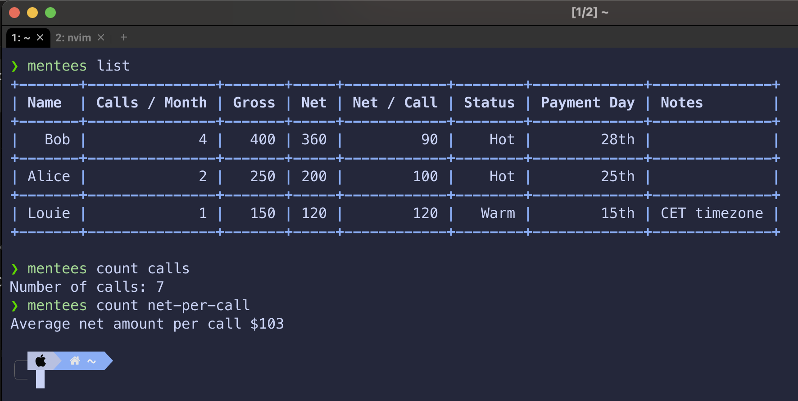

# Mentee CLI
This is a simple CLI that can CRUD mentees from a local SQLite database. In addition,
the CLI allows you to query the database for totals or averages of various fields.

#

## Why?
I built this CLI purely to learn Rust. I've learnt a lot getting the project to this stage,
and there's plenty more features I'd like to add. However, there's other unfinished side projects
I need to attend to.
